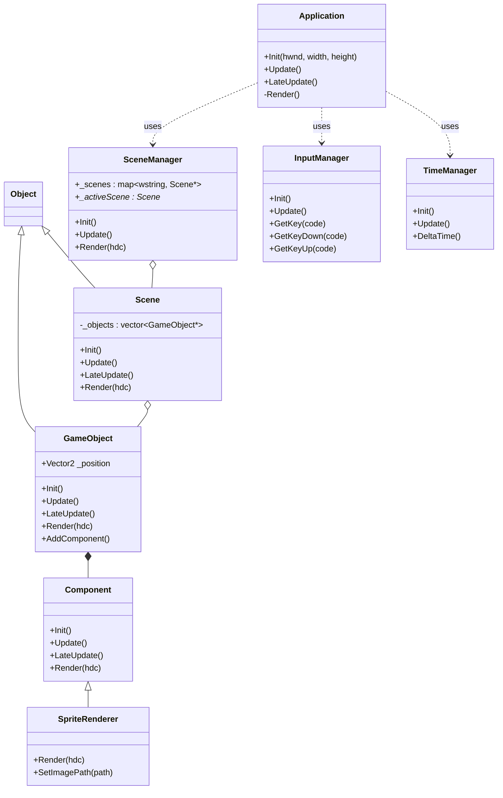

# 프로젝트 코드 분석

## 1. 클래스 구조 그래프

## 2. 핵심 코드 기능

### Application 클래스 (`devApplication.h`)
`Application` 클래스는 게임 엔진 로직의 진입점입니다. 초기화, 업데이트, 렌더링을 포함한 메인 루프를 처리합니다.
-   **Init**: 윈도우와 GDI+를 초기화합니다.
-   **Update/LateUpdate**: 매 프레임마다 게임 로직을 업데이트하기 위해 호출됩니다.
-   **Render**: 더블 버퍼링과 화면 지우기(clearing)를 처리합니다.

### GameObject & Component 시스템 (`devGameObject.h`, `devComponent.h`)
이 프로젝트는 컴포넌트 기반 아키텍처(composition-based architecture)를 사용합니다.
-   **GameObject**: 게임 내의 엔티티를 나타냅니다. 위치(Position)와 `Component` 목록을 보유합니다.
-   **Component**: 동작(Behavior)을 위한 기본 클래스입니다. 구체적인 기능(예: 렌더링)은 이 클래스를 상속받아 구현됩니다.
-   **AddComponent<T>**: 게임 오브젝트에 컴포넌트를 동적으로 추가하는 템플릿 메서드입니다.

### Scene 관리 (`devSceneManager.h`, `devScene.h`)
-   **SceneManager**: 여러 씬(예: Title, Play)을 관리하는 정적(static) 클래스입니다. 씬 간의 전환을 처리하고 활성화된 씬만 업데이트합니다.
-   **Scene**: `GameObject`들의 목록을 포함합니다. 소속된 모든 오브젝트에게 Update와 Render 호출을 위임합니다.

### 입력 & 시간 (`devInputManager.h`, `devTimeManager.h`)
-   **InputManager**: 키보드 입력 상태(Pressed, Down, Released, None)를 처리합니다. 매 프레임(또는 `_inputThread`에서 힌트를 얻을 수 있듯이 별도 스레드에서) 상태를 업데이트하는 것으로 보입니다.
-   **TimeManager**: 고해상도 성능 카운터를 사용하여 `DeltaTime`을 계산하며, 프레임 레이트에 독립적인 움직임을 보장합니다.
